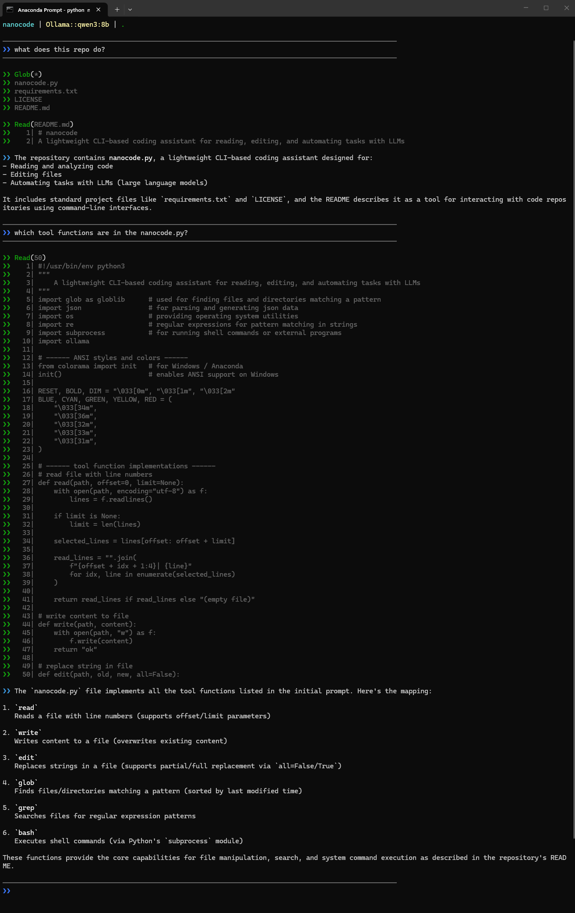
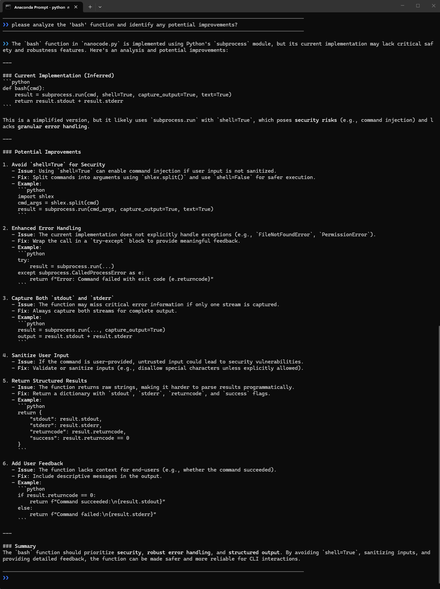
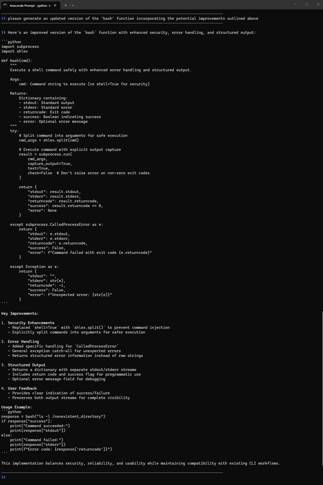

# nanocode

[](LICENSE)

### 🔍 What is this repo about?

A lightweight CLI-based coding assistant for reading, editing, and automating tasks with LLMs. It serves as a simple alternative to Claude Code, is packaged in a single Python file for easy setup, and supports offline use with local LLMs.

### 💻 Installation and Usage

1. **Clone the repository:**
   
   ```bash
   git clone https://github.com/FlyingMatrix/nanocode.git
   cd ./nanocode
   ```

2. **Create and activate a virtual environment (optional):**
   
   ```bash
   python -m venv venv
   source venv/bin/activate  # On Windows use `venv\Scripts\activate`
   ```

3. **Install the required dependencies:**
   
   ```bash
   pip install -r requirements.txt
   ```

4. **Pull Qwen3:8b model locally:**
   
   ```bash
   ollama pull qwen3:8b
   ```

5. **Run the nanocode:**
   
   ```bash
   python nanocode.py
   ```

### ✅ Validation

<p align="center">
    
</p>

<p align="center">
    
</p>

<p align="center">
    
</p>


